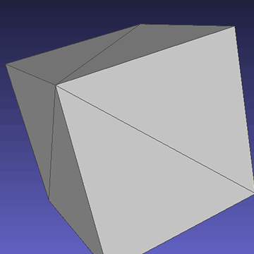
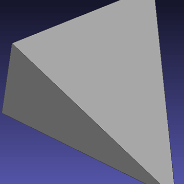
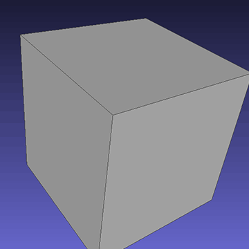
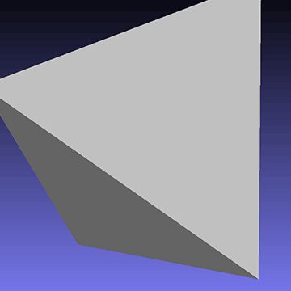
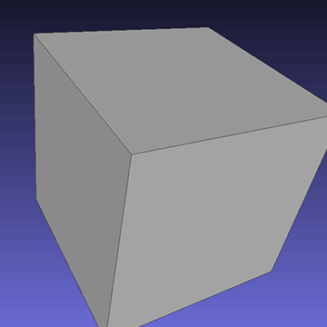
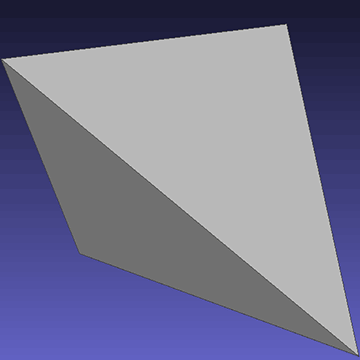

# Mesh Subdivisions
These subdivision algorithms are implemented: 
+ Loop
+ Catmull-Clark
+ Doo-Sabin

Algorithms are applied on an obj file. Only the position of vertices are modified.

## Contributor

[MmmmHeee](https://github.com/MmmmHeee): Loop Subdivision

[RoarlisF/KP31](https://github.com/SuomiKP31): Catmull-Clark Subdivision

[Qihao Zhang](https://github.com/zhaqu): Doo-Sabin Subdivision

## Result

Here are some gifs showcasing 1-3 iterations of these algorithms. We used MeshLab for visualization.

Loop Subdivision:

Catmull-Clark Subdivision:

Doo-Sabin Subdivision:

